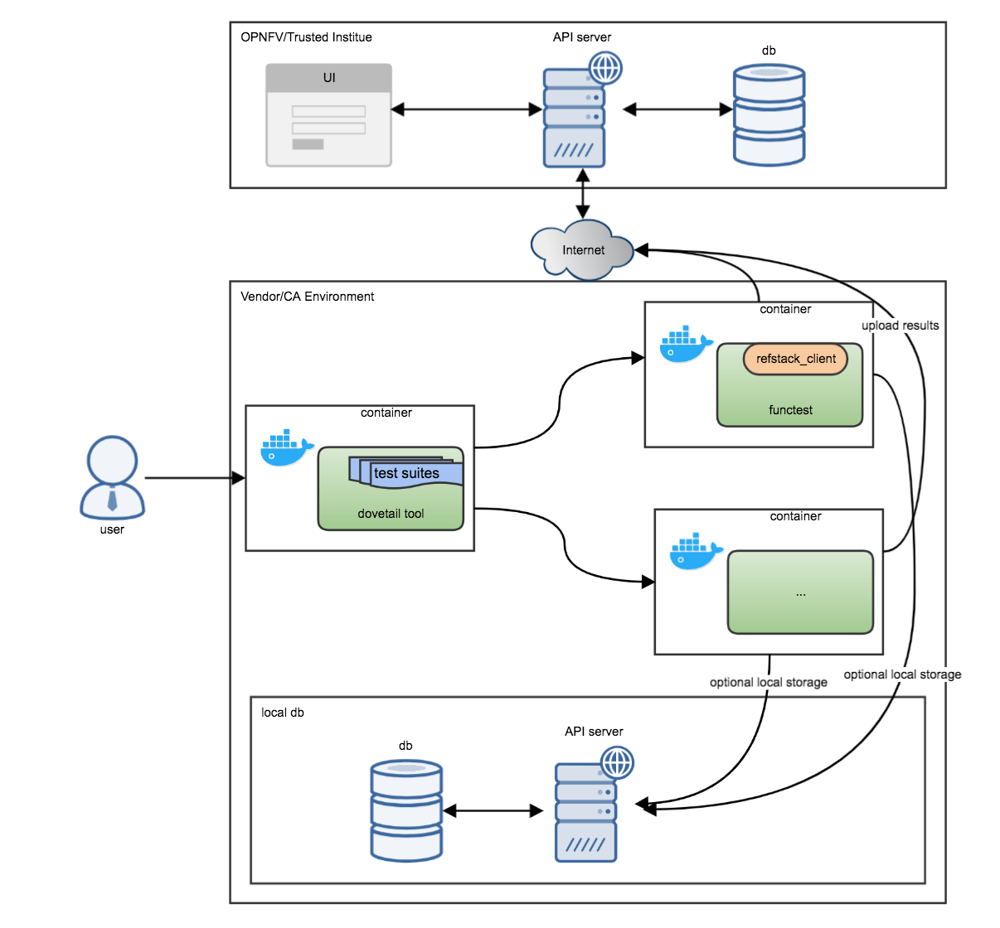
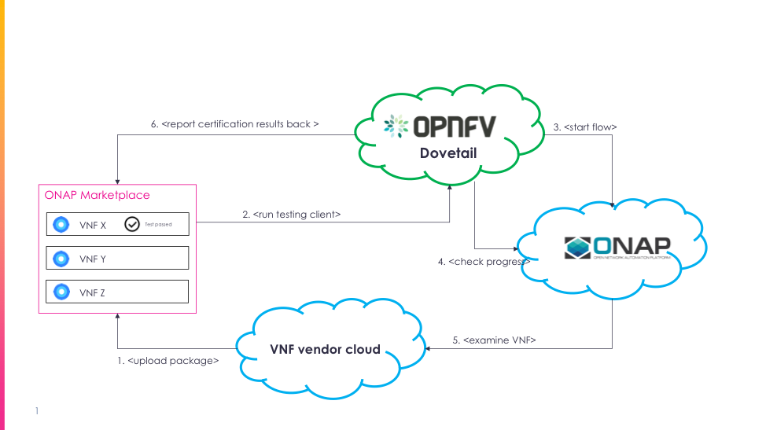

.. This work is licensed under a Creative Commons Attribution 4.0 International License.
.. http://creativecommons.org/licenses/by/4.0
.. Dovetail Integeration documentation master file, created by
   sphinx-quickstart on Fri Feb 23 11:49:11 2018.
   You can adapt this file completely to your liking, but it should at least
   contain the root `toctree` directive.

Welcome to Dovetail Integration's documentation!
=================================================

Contents:

.. toctree::
   :maxdepth: 2

Indices and tables
==================

* :ref:`genindex`
* :ref:`search`

User Stories
============

1. An ONAP User wants to ensure that VNFs which appear in the VNF
   Marketplace can be on-boarded with the Service Design & Creation tool
   without errors.

2. An ONAP User would like to be able to run VNF Certification tests on
   demand using a common user interface independent of the test being
   run.

3. An ONAP Certification Authority wants a central repository in which
   to examine the results of tests run by ONAP Users

4. An ONAP Certification Authority wants to be able to determine that
   VNF certification tests run by ONAP Users were executed properly.

5. An ONAP VNF Test Developer wants a consistent environment in which to
   develop tests.

OPNFV Dovetail Description
==========================

The Open Platform for NFV (OPNFV) is a collaborative project under the
Linux Foundation that is transforming global networks through open
source Network Functions Virtualization (NFV). OPNFV focuses on
developing test suites for Open Source implementations of the NFV
infrastructure components such as those specified in the ETSI Mano
architecture. Areas of focus in OPNFV include: Virtualized
Infrastructure Managers (VIM) such as OpenStack and Software Defined
Networking Controllers (SDNC) such as Open Daylight.

The OPNFV Dovetail project is responsible for the testing framework in
OPNFV. The Dovetail testing framework is currently used by all of the
active OPNFV projects. Dovetail has been through ~3 OPNFV release cycles
and has been hardened in the process. The Dovetail community includes
~15 companies and ~20 active developers.

The Dovetail test framework includes the following features which make
it ideal as the test framework for VNF certification testing:

1. Provides a Generic Test Framework

..

    While the Dovetail project is currently being used in OPNFV as the
    test framework for NFV infrastructure testing, there is nothing that
    limits the Dovetail test framework to NFV infrastructure testing.
    This allows the same test framework to be used across multiple NFV
    initiatives (OPNFV and ONAP) and across multiple (NFV infrastructure
    and VNF certification) test suites.

2. Separates the Vendor and Certification Authority environment

..

    Dovetail uses an authenticated REST interface which is used by the
    test environment to report test results to the test repository. This
    allows the test repository to be located in a different
    administrative domain than the test runtime environment.

3. Separates the test environment from the test framework environment

    Dovetail launches tests in a Docker container. This provides some
    isolation of the test environment from the test framework
    environment.

Figure 1 below illustrates the Dovetail test framework architecture.

Figure 1: OPNFV Dovetail Test Framework Architecture

Implementation Overview
=======================

OPNFV Dovetail will be integrated into the ONAP VNF Marketplace. The
ONAP VNF Marketplace is an ONAP application which displays all VNFs that
are available in an ONAP instantiation for incorporation into an ONAP
Network Service. Dovetail will be integrated into the VNF Marketplace
ingest flow and will also be available as a general service which can be
used to run additional VNF certification tests after the VNF Package has
been uploaded to the VNF Marketplace.

The VNF Marketplace ingest flow performs basic tests on a VNF package
before it is uploaded into the ONAP VNF Marketplace. Tests which fall
into this category will be incorporated into the ONAP VNF Package
Validation test suite.

The Dovetail client will also be available as a service in the VNF
Marketplace. The Dovetail client is an interactive application which
allows additional VNF Certification tests to be run on a VNF after the
VNF Package has been uploaded to the VNF Marketplace. The Dovetail
client will indicate which certification tests have been successfully
run on each VNF in the VNF Marketplace. VNF Vendors that are interested
in obtaining additional certifications for VNFs that have been uploaded
in the marketplace will have the ability to work with Certification Test
suppliers to obtain and run advanced certification tests. Figure 2
illustrates how the VNF Certification Framework is being integrated into
ONAP.

Figure 2: ONAP VNF Certification Framework

Figure 2 illustrates the flow that is used to execute the VNF Package On
Boarding test suite as part of the VNF ingest flow of the ONAP VNF
Marketplace.

1. Initiate Upload

..

    The VNF Vendor initiates a VNF upload request to the ONAP VNF
    Marketplace. This API call includes a reference to the VNF Package
    the vendor wants to upload.

2. Download testing client

..

    The VNF Marketplace executes the VNF Package On Boarding test suite
    as part of the VNF ingest flow. The first step in this process is to
    instantiate the Dovetail testing client. The Dovetail client is
    instantiated with a parameter which specifies the name of the test
    suite that Dovetail will execute. In this case Dovetail will execute
    the VNF Package On Boarding test suite.

3. Start Testing Flow

..

    Dovetail creates a Docker container for the test environment for
    each test in the test suite. The VNF Package On Boarding test suite
    includes tests which examine the contents of the contents of the VNF
    package, examine the orchestration template, and examine the VM
    image(s) of the VNF. Tests which use ONAP services will send
    asynchronous requests to the service via the ONAP Micro Services
    bus.

4. Check Progress

..

    Tests may check the status of ONAP services which are instantiated
    asynchronously.

5. Examine VNF

..

    ONAP services used by the VNF Package On Boarding test suite may
    need to access components of the VNF package for validate their
    content.

6. Report Certification Results Back

..

    As each test progresses, results are reported back through the
    Dovetail framework to the certification database. In this case, the
    certification database is local to the ONAP VNF Marketplace.

    If all of the tests in the VNF Package On Boarding test suite
    complete successfully, then the VNF Package and its contents are
    stored in the VNF Marketplace where they can be used for further
    ONAP VNF On Boarding processes.

Implementation Details
======================

Introduce a new test module under VNFSDK
----------------------------------------

A new test module ‘VnfTest’ will be added as a subproject in VNF-SDK.

This project will be similar to ‘Yardstick’ in the way it defines and
runs tests.

Dovetail to support new type
----------------------------

A new test framework type will be introduced to dovetail –
“VNFTest\ **”.**

Dovetail will handle the new type in the same way yardstick/functest
types are handled.

When dovetail needs to fetch the “VnfTest” docker image, it will consult
with configuration for determining the exact image name and version.

The “VnfTest” framework is expected to support the same APIs and format
currently used between dovetail and yardstick/functest.

