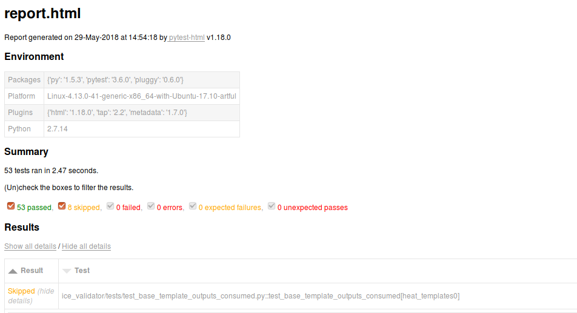

.. This work is licensed under a Creative Commons Attribution 4.0 International License.
.. http://creativecommons.org/licenses/by/4.0
.. Copyright 2018 Orange Labs.

ICE validation scripts
======================

The ICE validation scripts are based on the python ``pytest`` tool.
These scripts check that the Heat Templates are compliant with the ONAP Heat Template Guidelines.

Installation
------------

This software is not platform dependent and can be run in a Windows, Unix or
OS X environment.

- Install python 2.7 or python 3
- Install pip

In addition to python, this project requires the following packages:

- pytest
- PyYAML

Depending on the desired output format, you should add the following optional packages:

- pytest-tap
- pytest-html

These can be installed using pip (assuming pip is installed) with the command:

``$ pip install pytest PyYAML pytest-tap pytest-html``

Usage
-----

Retrieve the ICE scripts, by cloning the sources:

``$ git clone https://git.onap.org/vnfsdk/ice``

Go into the ice_validator directory:

``$ cd ice/validation-scripts/ice_validator``

The Heat templates validation may generate different ouput format (plain, tap, html):

- plain format

``$ pytest --template-directory=<Directory>``

- tap format

``$ pytest --tap-stream --template-directory=<Directory>``

- html format

``$ pytest --html=/path/to/report.html --template-directory=<Directory>``

NB: ``<Directory>`` is the absolute path of the folder containing the Heat
Templates to be verified.

Figure 1: example of html report generated by ICE scripts
