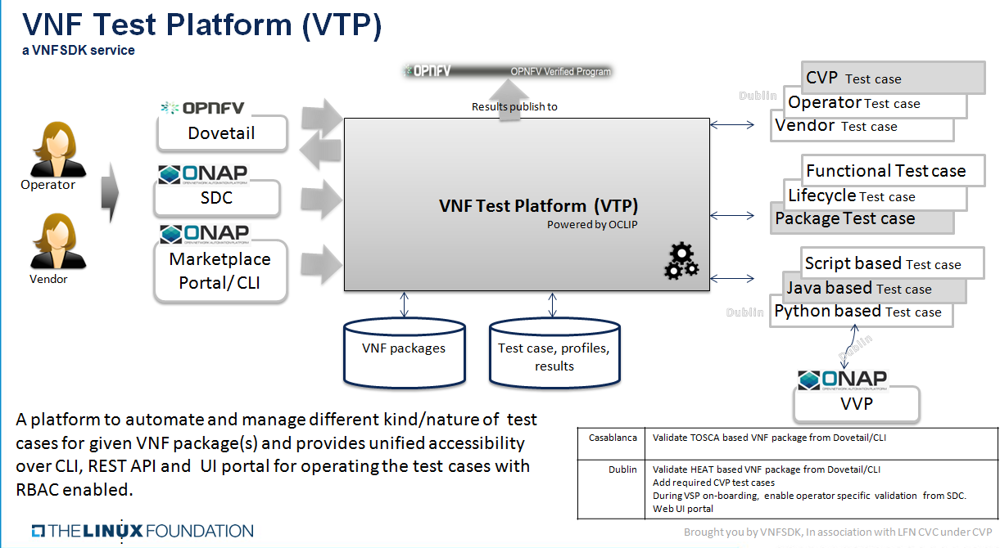
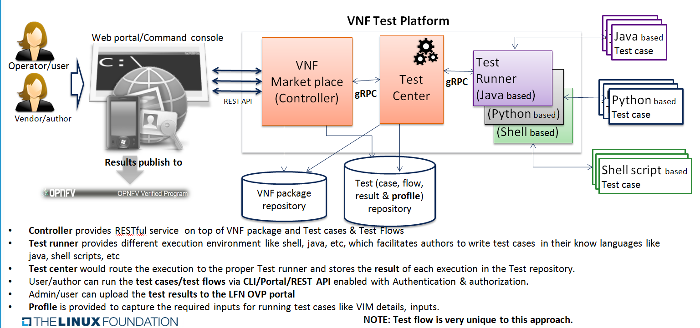
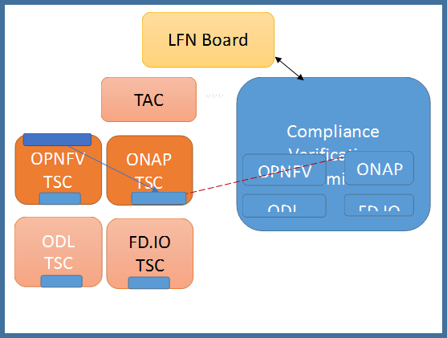

.. This work is licensed under a Creative Commons Attribution 4.0 International License.
.. http://creativecommons.org/licenses/by/4.0
.. Copyright 2018 Huawei Technologies Co., Ltd.

=======================================
VNF SDK Compliance Verification Program
=======================================

.. toctree::
   :maxdepth: 1

Background
==========

LF Networking is providing a testing program to demonstrate SDN/NFV 
capabilities and interoperability.

Program began with OPNFV Verified Programs

- Supports both self-testing and third-party lab testing

- Initial version will test VIM+NFVI

We propose expanding the program in 2018 to include VNF Compliance

- Requirements and tests defined by ONAP

- Test framework provided by OPNFV(Dovetail) and ONAP VNF Test Platform (VTP)

- Back-end infrastructure provided by Linux Foundation

VNF Test Platform (VTP)
=======================
Deploy VNF test cases once and trigger it safely from anywhere 

Objectives
----------
* LFN/ONAP wants test platform where VNF packages could be certified using ONAP requirements to drive industry adoption
* Provide an platform where vendor/operator can develop, deploy, run test cases and query the results
* Test cases, test results and VNF should be manageable .i,e with authorization, so only user with given roles is allowed to perform operation like VNF package upload/download, run compliance verification tests, allow only specific VIM for specific users, etc.
* Test results should be persisted and should be available for human analysis later via LFN infrastructure.
* Provides test flow where author make flow across different test cases for a given program like compliance verification and  VNFREQS/SOL0004.
* Provide integration with OPNFV dovetail to run test cases across dovetail and VNFSDK.
* Deployable as docker container.

|image0|

Architecture
------------

|image1|

CVC Structures
==============

|image2|

Casablanca Implemented requriements
===================================

.. list-table::
   :header-rows: 1

   * - **Requirement No.**
     - **Requirement Description**

   * - R-02454
     - The VNF MUST support the existence of multiple major/minor versions of the VNF software and/or sub-components and interfaces that support both forward and backward compatibility to be transparent to the Service Provider usage.

   * - R-04298
     - The VNF provider MUST provide their testing scripts to support testing.

   * - R-26681
     - The VNF provider MUST provide the binaries and images needed to instantiate the VNF (VNF and VNFC images).

   * - R-35851
     - The VNF Package MUST include VNF topology that describes basic network and application connectivity internal and external to the VNF including Link type, KPIs, Bandwidth, latency, jitter, QoS (if applicable) for each interface.

   * - R-66070
     - The VNF Package MUST include VNF Identification Data to uniquely identify the resource for a given VNF provider. The identification data must include: an identifier for the VNF, the name of the VNF as was given by the VNF provider, VNF description, VNF provider, and version.

   * - R-77707
     - The VNF provider MUST include a Manifest File that contains a list of all the components in the VNF package.
