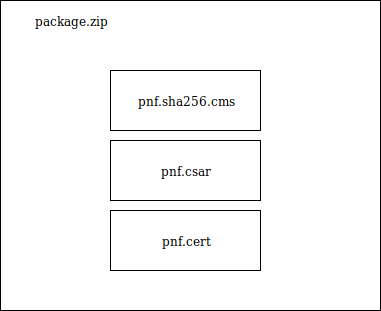

.. This work is licensed under a Creative Commons Attribution 4.0 International License.
.. http://creativecommons.org/licenses/by/4.0
.. Copyright 2018 Huawei Technologies Co., Ltd.

=======================================
VNF SDK Compliance Verification Program
=======================================

.. toctree::
   :maxdepth: 1

Background
==========

LF Networking is providing a testing program to demonstrate SDN/NFV
capabilities and interoperability.

Program began with OPNFV Verified Programs

- Supports both self-testing and third-party lab testing

- Initial version will test VIM+NFVI

We propose expanding the program in 2018 to include VNF Compliance

- Requirements and tests defined by ONAP

- Test framework provided by OPNFV(Dovetail) and ONAP VNF Test Platform (VTP)

- Back-end infrastructure provided by Linux Foundation

VNF Test Platform (VTP)
=======================
Deploy VNF/PNF test cases once and trigger it safely from anywhere

Objectives
----------
* LFN/ONAP wants test platform where VNF packages could be certified using ONAP requirements to drive industry adoption
* Provide an platform where vendor/operator can develop, deploy, run test cases and query the results
* Test cases, test results and VNF should be manageable .i,e with authorization, so only user with given roles is allowed to perform operation like VNF package upload/download, run compliance verification tests, allow only specific VIM for specific users, etc.
* Test results should be persisted and should be available for human analysis later via LFN infrastructure.
* Provides test flow where author make flow across different test cases for a given program like compliance verification and  VNFREQS/SOL0004.
* Provide integration with OPNFV dovetail to run test cases across dovetail and VNFSDK.
* Deployable as docker container.

|image0|

.. |image0| image:: VTP.png
   :height: 600px
   :width: 900px

Architecture
------------

|image1|

.. |image1| image:: VTParch.png
   :height: 600px
   :width: 900px

VTP deployment
----------------

Install VTP Backend
~~~~~~~~~~~~~~~~~~~~~~~~~~

export NEXUS_DOCKER_REPO=nexus3.onap.org:10001

export REFREPO_TAG=1.2.1-STAGING-20181228T020411Z

export POSTGRES_TAG=latest

export MTU=1450

wget https://raw.githubusercontent.com/onap/vnfsdk-refrepo/master/vnfmarket-be/deployment/install/docker-compose.yml

docker-compose up -d

Install VTP CLI
~~~~~~~~~~~~~~~~

export CLI_TAG=2.0.5-STAGING-20181227T184001Z

docker pull ${NEXUS_DOCKER_REPO}/onap/cli:${CLI_TAG}

docker run -d -e OPEN_CLI_MODE=daemon -p 30260:80 -p 30271:8080 --name vtp-cli ${NEXUS_DOCKER_REPO}/onap/cli:${CLI_TAG}

VERIFY deployment
~~~~~~~~~~~~~~~~~~~~~

docker exec vtp-cli  bash -c "OPEN_CLI_PRODUCT_IN_USE=onap-vtp oclip vnftest-list --host-url http://<docker host ip>:8702"

+----------------+------------------------+
|tescase         |yaml                    |
+----------------+------------------------+
|csar-validate   |vtp-validate-csar.yaml  |
+----------------+------------------------+

NOTE: if failed to run, then follow below guidelines

    docker exec -it refrepo  bash

    export OPEN_CLI_HOME=/opt/vtp

    cd $OPEN_CLI_HOME/bin

    ./oclip-grpc-server.sh &

    Exit docker by running CTRL+p+q

    Run the vnftest-list again as above and verity that its working !!

Setup sample csars
~~~~~~~~~~~~~~~~~~~

Download the sample CSAR to VTP docker from github

    docker exec -it refrepo  bash

    echo nameserver 8.8.8.8 >> /etc/resolv.conf

    cd /opt/vtp

    mkdir csar

    cd csar

    wget https://github.com/onap/vnfsdk-validation/raw/master/csarvalidation/src/test/resources/VoLTE.csar

    exit

NOTE: To test vendor specific CSAR, copy them to /opt/vtp/csar folder using 'docker cp xxx.csar refrepo:/opt/vtp/csar' command

Run the validate csar test case
~~~~~~~~~~~~~~~~~~~~~~~~~~~~~~~~~

docker exec vtp-cli  bash -c "OPEN_CLI_PRODUCT_IN_USE=onap-vtp BUILD_TAG=demo oclip vnftest-run --name csar-validate --param csar=/opt/vtp/csar/VoLTE.csar --host-url http://<docker host ip>:8702"

+------------+------------------+
|property    |value             |
+------------+------------------+
|results     |{error=SUCCESS}   |
+------------+------------------+
|build_tag   |demo              |
+------------+------------------+
|criteria    |PASS              |
+------------+------------------+

CVC Structures
==============

|image2|

Casablanca Implemented requirements
===================================

.. list-table::
   :header-rows: 1

   * - **Requirement No.**
     - **Requirement Description**

   * - R-02454
     - The VNF MUST support the existence of multiple major/minor versions of the VNF software and/or sub-components and interfaces that support both forward and backward compatibility to be transparent to the Service Provider usage.

   * - R-04298
     - The VNF provider MUST provide their testing scripts to support testing.

   * - R-26681
     - The VNF provider MUST provide the binaries and images needed to instantiate the VNF (VNF and VNFC images).

   * - R-35851
     - The VNF Package MUST include VNF topology that describes basic network and application connectivity internal and external to the VNF including Link type, KPIs, Bandwidth, latency, jitter, QoS (if applicable) for each interface.

   * - R-66070
     - The VNF Package MUST include VNF Identification Data to uniquely identify the resource for a given VNF provider. The identification data must include: an identifier for the VNF, the name of the VNF as was given by the VNF provider, VNF description, VNF provider, and version.

   * - R-77707
     - The VNF provider MUST include a Manifest File that contains a list of all the components in the VNF package.

   * - R-77786
     - The VNF Package MUST include all relevant cookbooks to be loaded on the ONAP Chef Server.

Dublin Implemented requirements
===================================

.. list-table::
   :header-rows: 1

   * - **Requirement No.**
     - **Requirement Description**

   * - R-10087
     - The VNF/PNF package MUST contain all standard artifacts as specified in ETSI GS NFV-SOL004 including Manifest file, VNFD/PNFD (or Main TOSCA/YAML based Service Template) and other optional artifacts. CSAR Manifest file as per SOL004 - for example ROOT\ MainServiceTemplate.mf

   * - R-17852
     - The VNFD/PNFD MAY include TOSCA/YAML definitions that are not part of NFV Profile. If provided, these definitions MUST comply with TOSCA Simple Profile in YAML v.1.2.

   * - R-35854
     - The VNF/PNF Descriptor (VNFD/PNFD) provided by VNF/PNF vendor MUST comply with TOSCA/YAML based Service template for VNF/PNF descriptor specified in ETSI NFV-SOL001.

   * - R-57019
     - The PNF TOSCA CSAR package Manifest file MUST start with the PNF package metadata in the form of a name-value pairs. Each pair shall appear on a different line. The name is specified as following: pnfd_provider, pnfd_name, pnfd_release_date_time, pnfd_archive_version

   * - R-87234
     - The VNF/PNF package provided by a VNF/PNF vendor MAY be either with TOSCA-Metadata directory (CSAR Option 1) or without TOSCA-Metadata directory (CSAR Option 2) as specified in ETSI GS NFV-SOL004. On-boarding entity (ONAP SDC) must support both options.

   * - R-146092
     - The VNF/PNF package Manifest file MUST contain: non-mano artifact set with following ONAP public tag: onap_ves_events, onap_pm_dictionary, onap_yang_module, onap_others
  
   * - R-293901
     - For a VNF/PNF package CSAR MUST contains a TOSCA-Metadata directory with the TOSCA.meta metadata file. The TOSCA.meta metadata file MUST includes block_0 with the Entry-Definitions keyword pointing to a TOSCA definitions YAML file. Additional keyname extension must be included as following: ETSI-Entry-Manifest, ETSI-Entry-Change-Log

   * - R-787965
     - If the VNF or PNF CSAR Package utilizes Option 2 for package security, then the complete CSAR file MUST be digitally signed with the VNF or PNF provider private key. The VNF or PNF provider delivers one zip file consisting of the CSAR file, a signature file and a certificate file that includes the VNF or PNF provider public key. The certificate may also be included in the signature container, if the signature format allows that. The VNF or PNF provider creates a zip file consisting of the CSAR file with .csar extension, signature and certificate files. The signature and certificate files must be siblings of the CSAR file with extensions .cms and .cert respectively.

OCLIP additional parameters in Dublin
=====================================

To run validation of PNF csar additional --pnf parameter must be used.

  oclip --product onap-vtp csar-validate --pnf --csar <path to pnf.csar or package.zip>

Package zip structure 
=====================
|image3|

Generate certificates
---------------------
  openssl req -nodes -x509 -sha256 -newkey rsa:4096 -keyout "pnf.key" -out "pnf.cert" -days 365 -subj "/C=NL/ST=Zuid Holland/L=Rotterdam/O=Sparkling Network/OU=IT Dept/CN=$(whoami)s Sign Key"

Sign csar file with private key
-------------------------------
  openssl dgst -sha256 -sign "pnf.key" -out pnf.sha256.cms pnf.csar

Verify signature
----------------
  openssl dgst -sha256 -verify  <(openssl x509 -in "pnf.cert"  -pubkey -noout) -signature pnf.sha256.cms pnf.csar