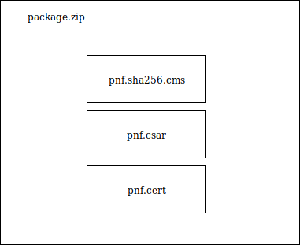

.. This work is licensed under a Creative Commons Attribution 4.0 International License.
.. http://creativecommons.org/licenses/by/4.0
.. Copyright 2019 Huawei Technologies Co., Ltd.

.. _csar-validation:

CSAR Compliance check for SOL004 and SOL001
===========================================

ONAP enabled the required compliance check by following VNFREQS and reports the non-compliant entries as errors.

When :ref:`vnf-test-platform` is deployed, by default this testing is enabled with test case name as below

scenario: onap-vtp

testsuite: validation

testcase: csar-validate

And every VNFREQS is modeled as separate test case with name csar-validate-rxxxxx, where xxxxx represents the VNFREQS.

Casablanca Implemented requirements
===================================

.. list-table::
   :header-rows: 1

   * - **Requirement No.**
     - **Requirement Description**

   * - R-02454
     - The VNF MUST support the existence of multiple major/minor versions of the VNF software and/or sub-components and interfaces that support both forward and backward compatibility to be transparent to the Service Provider usage.

   * - R-04298
     - The VNF provider MUST provide their testing scripts to support testing.

   * - R-26681
     - The VNF provider MUST provide the binaries and images needed to instantiate the VNF (VNF and VNFC images).

   * - R-35851
     - The VNF Package MUST include VNF topology that describes basic network and application connectivity internal and external to the VNF including Link type, KPIs, Bandwidth, latency, jitter, QoS (if applicable) for each interface.

   * - R-66070
     - The VNF Package MUST include VNF Identification Data to uniquely identify the resource for a given VNF provider. The identification data must include: an identifier for the VNF, the name of the VNF as was given by the VNF provider, VNF description, VNF provider, and version.

   * - R-77707
     - The VNF provider MUST include a Manifest File that contains a list of all the components in the VNF package.

   * - R-77786
     - The VNF Package MUST include all relevant cookbooks to be loaded on the ONAP Chef Server.

Dublin Implemented requirements
===================================

.. list-table::
   :header-rows: 1

   * - **Requirement No.**
     - **Requirement Description**

   * - R-10087
     - The VNF/PNF package MUST contain all standard artifacts as specified in ETSI GS NFV-SOL004 including Manifest file, VNFD/PNFD (or Main TOSCA/YAML based Service Template) and other optional artifacts. CSAR Manifest file as per SOL004 - for example ROOT\ MainServiceTemplate.mf

   * - R-17852
     - The VNFD/PNFD MAY include TOSCA/YAML definitions that are not part of NFV Profile. If provided, these definitions MUST comply with TOSCA Simple Profile in YAML v.1.2.

   * - R-35854
     - The VNF/PNF Descriptor (VNFD/PNFD) provided by VNF/PNF vendor MUST comply with TOSCA/YAML based Service template for VNF/PNF descriptor specified in ETSI NFV-SOL001.

   * - R-57019
     - The PNF TOSCA CSAR package Manifest file MUST start with the PNF package metadata in the form of name-value pairs. Each pair shall appear on a different line. The name is specified as following: pnfd_provider, pnfd_name, pnfd_release_date_time, pnfd_archive_version

   * - R-87234
     - The VNF/PNF package provided by a VNF/PNF vendor MAY be either with TOSCA-Metadata directory (CSAR Option 1) or without TOSCA-Metadata directory (CSAR Option 2) as specified in ETSI GS NFV-SOL004. On-boarding entity (ONAP SDC) must support both options.

   * - R-146092
     - The VNF/PNF package Manifest file MUST contain: non-mano artifact set with following ONAP public tag: onap_ves_events, onap_pm_dictionary, onap_yang_module, onap_others

   * - R-293901
     - For a VNF/PNF package, CSAR MUST contains a TOSCA-Metadata directory with the TOSCA.meta metadata file. The TOSCA.meta metadata file MUST include block_0 with the Entry-Definitions keyword pointing to a TOSCA definitions YAML file. Additional keyname extension must be included as following: ETSI-Entry-Manifest, ETSI-Entry-Change-Log

   * - R-787965
     - If the VNF or PNF CSAR Package utilizes Option 2 for package security, then the complete CSAR file MUST be digitally signed with the VNF or PNF provider private key. The VNF or PNF provider delivers one zip file consisting of the CSAR file, a signature file and a certificate file that includes the VNF or PNF provider public key. The certificate may also be included in the signature container if the signature format allows that. The VNF or PNF provider creates a zip file consisting of the CSAR file with .csar extension, signature and certificate files. The signature and certificate files must be siblings of the CSAR file with extensions .cms and .cert respectively.

OCLIP additional parameters in Dublin
=====================================

To run validation of PNF csar additional --pnf parameter must be used.

  oclip --product onap-vtp csar-validate --pnf --csar <path to pnf.csar or package.zip>

Package zip structure
=====================
|image3|

Generate certificates
---------------------
  openssl req -nodes -x509 -sha256 -newkey rsa:4096 -keyout "pnf.key" -out "pnf.cert" -days 365 -subj "/C=NL/ST=Zuid Holland/L=Rotterdam/O=Sparkling Network/OU=IT Dept/CN=$(whoami)s Sign Key"

Sign csar file with the private key
-------------------------------
  openssl dgst -sha256 -sign "pnf.key" -out pnf.sha256.cms pnf.csar

Verify signature
----------------
  openssl dgst -sha256 -verify  <(openssl x509 -in "pnf.cert"  -pubkey -noout) -signature pnf.sha256.cms pnf.csar
