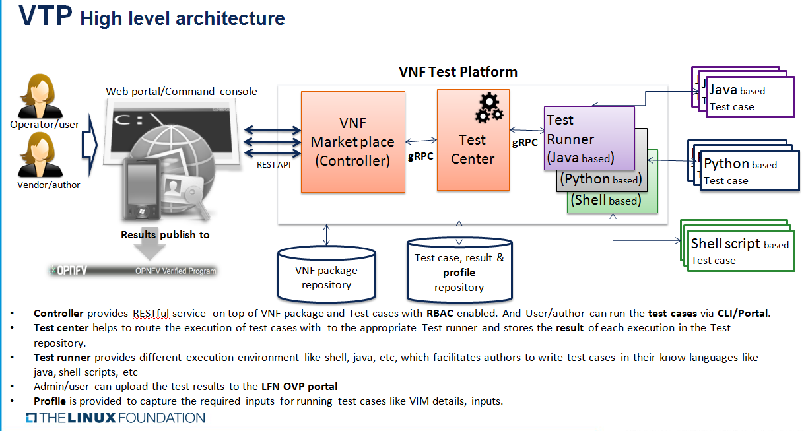

.. This work is licensed under a Creative Commons Attribution 4.0 International License.
.. http://creativecommons.org/licenses/by/4.0
.. Copyright 2019 Huawei Technologies Co., Ltd.

.. _vnf-test-platform:

VNF Test Platform (VTP)
=======================
Deploy VNF/PNF test cases once and trigger it safely from anywhere

Objectives
----------
* LFN/ONAP wants test platform where VNF packages could be certified using ONAP requirements to drive industry adoption
* Provide an platform where vendor/operator can develop, deploy, run test cases and query the results
* Test cases, test results and VNF should be manageable .i,e with authorization, so only user with given roles is allowed to perform operation like VNF package upload/download, run compliance verification tests, allow only specific VIM for specific users, etc.
* Test results should be persisted and should be available for human analysis later via LFN infrastructure.
* Provides test flow where author make flow across different test cases for a given program like compliance verification and  VNFREQS/SOL0004.
* Provide integration with OPNFV dovetail to run test cases across dovetail and VNFSDK.
* Deployable as docker container.

|image0|

.. |image0| image:: VTP.png
   :height: 600px
   :width: 900px

Architecture
------------

|image1|

VTP deployment
----------------

Install VTP Backend
~~~~~~~~~~~~~~~~~~~~~~~~~~

export NEXUS_DOCKER_REPO=nexus3.onap.org:10001

docker login $NEXUS_DOCKER_REPO -u docker -p docker

export REFREPO_TAG=1.3.0

export POSTGRES_TAG=latest

export MTU=1450

wget https://raw.githubusercontent.com/onap/vnfsdk-refrepo/master/vnfmarket-be/deployment/install/docker-compose.yml

docker-compose up -d

run docker ps and following entries would be reported::

 root@mrkanag:~# docker ps
 CONTAINER ID        IMAGE                                                       COMMAND                  CREATED             STATUS              PORTS                                                                                NAMES
 4d42ef0bc1b3        nexus3.onap.org:10001/onap/vnfsdk/refrepo:1.3.0             "/service/docker-ent…"   2 days ago          Up 2 days           0.0.0.0:8000->8000/tcp, 0.0.0.0:8702-8703->8702-8703/tcp, 0.0.0.0:50051->50051/tcp   refrepo
 25a86d9b0e81        nexus3.onap.org:10001/onap/vnfsdk/refrepo/postgres:latest   "docker-entrypoint.s…"   2 days ago          Up 2 days           0.0.0.0:5432->5432/tcp                                                               postgres

VTP usage guide
---------------

**1. List scenario**::

 GET {{vtp-host}}/onapapi/vnfsdk-marketplace/v1/vtp/scenarios

 [
    {
        "name": "scenario-1",
        "description": "Test scenario 1 \n"
    },
    {
        "name": "scenario-2",
        "description": "Test scenario 1 \n"
    },
    {
        "name": "open-cli",
        "description": "OPEN CLI PLATFORM provides a dynamic platform to load and execute commands\nbased on the Open Command Specification (OCS) 1.0. \n"
    }
 ]

**2. List Test suites**::

 GET {{vtp-host}}/onapapi/vnfsdk-marketplace/v1/vtp/scenarios/scenario-1/testsuites
 [
    {
        "name": "testsuite-1",
        "description": "testsuite 1"
    },
    {
        "name": "testsuite-2",
        "description": "testsuite 2"
    }
 ]

**3. List Test cases**::

 GET {{vtp-host}}/onapapi/vnfsdk-marketplace/v1/vtp/scenarios/scenario-1/testcases
 [
    {
        "testCaseName": "s1.ts1.testcase-1",
        "testSuiteName": "testsuite-1"
    },
    {
        "testCaseName": "s1.ts1.testcase-2",
        "testSuiteName": "testsuite-1"
    },
    {
        "testCaseName": "s1.ts1.testcase-3",
        "testSuiteName": "testsuite-1"
    },
    {
        "testCaseName": "s1.ts2.testcase-1",
        "testSuiteName": "testsuite-2"
    },
    {
        "testCaseName": "s1.ts2.testcase-2",
        "testSuiteName": "testsuite-2"
    }
 ]

**4. Show Test case details**::

 GET {{vtp-host}}/onapapi/vnfsdk-marketplace/v1/vtp/scenarios/scenario-1/testsuites/testsuite-1/testcases/s1.ts1.testcase-1

 {
    "testCaseName": "s1.ts1.testcase-1",
    "testSuiteName": "testsuite-1",
    "descripton": "s1.ts1.testcase-1",
    "author": "Kanagaraj Manickam kanagaraj.manickam@huawei.com",
    "inputs": [
        {
            "name": "input1",
            "description": "Input 1",
            "type": "string",
            "isOptional": false,
            "metadata": {
                "allowed_value": [
                    "a",
                    "b",
                    "c"
                ]
            }
        },
        {
            "name": "input2",
            "description": "Input 2",
            "type": "string",
            "defaultValue": "v2",
            "isOptional": true
        }
    ],
    "outputs": [
        {
            "name": "output1",
            "description": "output 1",
            "type": "string"
        }
    ]
 }

**5. List Test cases in test suite**::

 GET {{vtp-host}}/onapapi/vnfsdk-marketplace/v1/vtp/scenarios/scenario-2/testcases?testSuiteName=testsuite-1
 [
    {
        "testCaseName": "s2.ts1.testcase-1",
        "testSuiteName": "testsuite-1"
    }
 ]

**6. Run a test case**::

  GET {{vtp-host}}/onapapi/vnfsdk-marketplace/v1/vtp/executions
 [
    {
        "scenario": "open-cli",
        "testCaseName": "schema-list",
        "testSuiteName": "schema",
        "executionId": "00dfda6c-df16-4c5b-a731-3d531a7aafa5-1550505316115",
        "requestId": "00dfda6c-df16-4c5b-a731-3d531a7aafa5",
        "status": "completed",
        "startTime": "2019-02-18T15:55:16.138",
        "endTime": "2019-02-18T15:55:16.220"
    }
 ]

**7. Retrieve the execution result**::

 GET {{vtp-host}}/onapapi/vnfsdk-marketplace/v1/vtp/executions/ebaa5f21-ed68-4098-97a9-775ac8800f09-1550575025614
 {
    "scenario": "scenario-1",
    "testCaseName": "s1.ts2.testcase-1",
    "testSuiteName": "testsuite-2",
    "executionId": "ebaa5f21-ed68-4098-97a9-775ac8800f09-1550575025614",
    "parameters": {
        "input2": "v2",
        "input1": "v1"
    },
    "results": {
        "output1": "v1=v2"
    },
    "status": "completed",
    "startTime": "2019-02-19T11:17:05.670",
    "endTime": "2019-02-19T11:17:05.683"
 }

**8. Execute test case without file content (across scenario, test suites)**::

 POST {{vtp-host}}/onapapi/vnfsdk-marketplace/v1/vtp/executions?requestId=ebaa5f21-ed68-4098-97a9-775ac8800f09
 content-type multipart/form-data
 BODY:
  executions:
  [{
  "scenario": "scenario-1",
  "testSuiteName": "testsuite-1",
  "testCaseName": "s1.ts1.testcase-1",
  "parameters": {
    "input1": "v1",
    "input2": "v2"
  }
  },{
  "scenario": "scenario-1",
  "testSuiteName": "testsuite-2",
  "testCaseName": "s1.ts2.testcase-1",
  "parameters": {
    "input1": "v1"
  }
  },
  {
  "scenario": "open-cli",
  "testSuiteName": "schema",
  "testCaseName": "schema-validate",
  "parameters": {
      "schema-location": "file://s1.ts1.testcase-1.yaml"
  }
 }]

 RESPONSE:
 [
    {
        "scenario": "scenario-1",
        "testCaseName": "s1.ts1.testcase-1",
        "testSuiteName": "testsuite-1",
        "executionId": "ebaa5f21-ed68-4098-97a9-775ac8800f09-1550575025516",
        "parameters": {
            "input1": "v1",
            "input2": "v2"
        },
        "results": {
            "output1": "v1-v2"
        },
        "status": "COMPLETED",
        "startTime": "2019-02-19T11:17:05.464",
        "endTime": "2019-02-19T11:17:05.579"
    },
    {
        "scenario": "scenario-1",
        "testCaseName": "s1.ts2.testcase-1",
        "testSuiteName": "testsuite-2",
        "executionId": "ebaa5f21-ed68-4098-97a9-775ac8800f09-1550575025614",
        "parameters": {
            "input1": "v1"
        },
        "results": {
            "output1": "v1=v2"
        },
        "status": "COMPLETED",
        "startTime": "2019-02-19T11:17:05.579",
        "endTime": "2019-02-19T11:17:05.701"
    }
 ]

**9. Execute test case with file content**::

 POST {{vtp-host}}/onapapi/vnfsdk-marketplace/v1/vtp/executions?requestId=ebaa5f21-ed68-4098-97a9-775ac8800f07
 content-type multipart/form-data
 BODY:
  file -- file  s1.ts1.testcase-1.yaml content
  executions:
  [{
  "scenario": "open-cli",
  "testSuiteName": "schema",
  "testCaseName": "schema-validate",
  "parameters": {
      "schema-location": "file://s1.ts1.testcase-1.yaml"
  }
  }]

 RESPONSE:
 [
    {
        "scenario": "open-cli",
        "testCaseName": "schema-validate",
        "testSuiteName": "schema",
        "executionId": "ebaa5f21-ed68-4098-97a9-775ac8800f07-1550575843353",
        "parameters": {
            "schema-location": "d:/temp/vtp/temp-files/s1.ts1.testcase-1.yaml"
        },
        "results": [
            {}
        ],
        "status": "COMPLETED",
        "startTime": "2019-02-19T11:30:43.288",
        "endTime": "2019-02-19T11:30:43.672"
    }
 ]

Reference
----------

ONAP VTP Wiki_.

.. _Wiki: https://wiki.onap.org/pages/viewpage.action?pageId=43386304